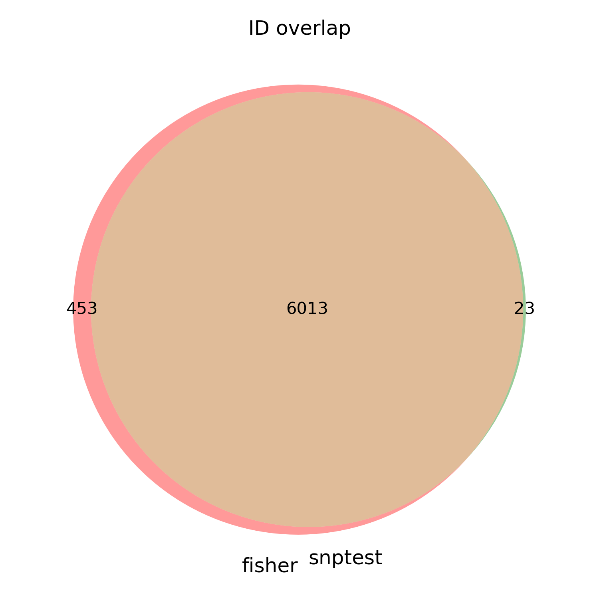

# DILI / DILI-ALH WES vs 1000G EUR Controls  
**Fisher Exact Test vs SNPTEST for Significant SNP Discovery (chr1)**

## 1. Overview

This repository documents an analysis workflow to identify significant SNPs associated with **drug-induced liver injury (DILI) and DILI-ALH** using **whole-exome sequencing (WES)** data. The case cohort consists of **137 DILI / DILI-ALH samples**, which are compared against **503 European (EUR) control samples** from the **1000 Genomes Project (1000G)**.

Two independent statistical approaches are used:

1. **Fisher exact test**
   - Manual derivation of allele counts from VCF data  
   - Construction of 2×2 contingency tables per SNP  

2. **SNPTEST**
   - Conversion of VCF data to SNPTEST-compatible formats (`.gen` and `.sample`)  
   - Association testing via the SNPTEST tool  

To speed up method development and validation, the initial implementation focuses on **chromosome 1 (chr1)** only. The same logic can later be extended to all chromosomes.

---

## 2. Data Description

### 2.1 Case Cohort

- **Phenotype:** DILI and DILI-ALH  
- **Number of samples:** 137  
- **Data type:** Whole-exome sequencing (WES)  
- **Format:** Variant Call Format (VCF), one or more VCFs representing the case cohort  
- **Scope:** For the current comparison, variants are restricted to **chr1**  

### 2.2 Control Cohort

- **Source:** 1000 Genomes Project (1000G)  
- **Population:** European (EUR)  
- **Number of samples:** 503  
- **Data type:** WES / genotype calls  
- **Format:** VCF, representing the EUR control cohort  
- **Scope:** Restricted to **chr1** for initial analyses  

> **Note:**  
> Due to privacy and data size constraints, raw VCFs and large intermediate files are **not** stored in this repository. Instead, the repository focuses on the **workflow description**, **analysis logic**, and will include **links to the scripts** used for processing once added.

---

## 3. Analysis Objectives

The primary objectives of this project are:

1. **Variant-level association testing**
   - Identify SNPs that are significantly associated with DILI / DILI-ALH when comparing the 137 cases to 503 1000G EUR controls.

2. **Methodological comparison**
   - Compare two different statistical approaches for SNP discovery:
     - Manual **Fisher exact test** based on explicit allele counts
     - **SNPTEST**-based association testing
   - Evaluate the degree of overlap and consistency between the two methods (e.g., shared significant SNPs, effect directions).

3. **Workflow validation on chr1**
   - Develop and validate the full pipeline using **chr1** as a test case, and establish a framework that can be extended to the full exome.

---

## 4. Methods – High-Level Overview

### 4.1 Fisher Exact Test Approach

For the Fisher exact test, the pipeline is built around explicit counting of alleles from the VCF files.

**Key ideas:**

- Each SNP is characterized by the number of **ALT alleles (POSITIVE)** and **non-ALT alleles (NEGATIVE)** observed in:
  - The **case cohort** (137 samples)
  - The **control cohort** (503 EUR samples)
- These counts are used to construct a 2×2 contingency table for each SNP, followed by Fisher exact testing.

**Conceptual steps:**

1. **Input VCF preparation (chr1)**
   - Start from per-sample or cohort-level VCFs for cases and controls.
   - Restrict variants to **chromosome 1 (chr1)**.
   - Apply quality filters, such as:
     - Depth of coverage (DP ≥ a given threshold, e.g., 20)
     - Genotype quality (GQ ≥ a given threshold, e.g., 30)
   - Retain only **SNPs** and typically only **biallelic variants** to simplify interpretation.

2. **Cohort-level VCFs**
   - Merge filtered per-sample case VCFs into a **case cohort VCF**.
   - Merge filtered per-sample control VCFs into a **control cohort VCF**.
   - Ensure both cohort VCFs have consistent variant representation (e.g., biallelic SNPs, consistent reference/alternate alleles).

3. **Per-SNP sample-level counts**
   - For each SNP in the cohort VCF, determine:
     - How many samples have **any non-missing genotype** for that SNP (`SNP_COUNT`).
     - How many samples have **no SNP** (i.e., genotype is reference / missing as defined; recorded as `NO_SNP_COUNT`).
     - How many samples are **heterozygous** (`0/1` → `AC=1_COUNT`).
     - How many are **homozygous for the ALT allele** (`1/1` → `AC=2_COUNT`).

4. **Derive allele counts**
   - For each SNP, compute:
     - **POSITIVE** = total number of ALT alleles  
       (e.g., `POSITIVE = 2 × (AC=2_COUNT) + 1 × (AC=1_COUNT)`)
     - **NEGATIVE** = total number of non-ALT alleles  
       (e.g., `NEGATIVE = 2 × (NO_SNP_COUNT) + 1 × (AC=1_COUNT)`)

5. **Merge case and control allele counts**
   - Using a unique SNP identifier (e.g., `CHR:POS:REF:ALT` or the `ID` column), join the case and control tables.
   - For each SNP, construct a 2×2 contingency table:

     |           | ALT (POSITIVE) | non-ALT (NEGATIVE) |
     |----------:|----------------:|-------------------:|
     | **Case**  | a               | b                  |
     | **Control** | c             | d                  |

6. **Fisher exact test**
   - For each SNP, perform a Fisher exact test based on the `a, b, c, d` counts.
   - Record:
     - p-value
     - Odds ratio (if computed)
     - Confidence intervals (optional, depending on implementation)

7. **Significance threshold**
   - Apply a genome-wide significance threshold, often **p < 5 × 10⁻⁸**, to define significant SNPs.
   - Export a summary table of significant SNPs (e.g., SNP ID, counts, p-value, odds ratio).

> Once scripts are added, links (e.g., `[Fisher pipeline scripts](link_here)`) can be placed here to point to the exact implementation in this repo.

---

### 4.2 SNPTEST Approach

The SNPTEST pipeline analyzes the same underlying data (137 cases vs 503 controls on chr1) but uses SNPTEST’s association framework instead of manual allele counting.

**Key ideas:**

- Use SNPTEST’s ability to model association at each SNP using genotype data.
- Operate on SNPs that are **common** to both case and control cohorts.
- Compare the resulting significant SNPs and p-values to those from the Fisher approach.

**Conceptual steps:**

1. **Identify common SNPs**
   - From the processed/filtered case and control VCFs, identify the shared set of SNPs on chr1.
   - This can be done by intersecting based on:
     - `CHR` + `POS` + `REF` + `ALT`, or  
     - rsID (`ID` column), if available and consistent.
   - The result is a list of **common SNPs** present in both case and control cohorts.

2. **Prepare SNPTEST input**
   - Convert the common-SNP VCF data to SNPTEST-compatible formats:
     - `.gen` file: genotype probabilities or dosages for each SNP and sample.
     - `.sample` file: sample identifiers and phenotypic information.
   - In the `.sample` file, define:
     - A phenotype column (e.g., 1 = control, 2 = case).
     - Additional covariates as needed (e.g., sex, PCs), if used.

3. **Run SNPTEST**
   - Use SNPTEST to perform an association analysis, typically specifying:
     - The phenotype (case vs control)
     - The type of analysis (e.g., frequentist test using an additive genetic model)
   - For each SNP, SNPTEST will typically output:
     - p-value
     - Effect size (`beta` or log-odds)
     - Standard error
     - Allele frequency and other statistics

4. **Filter significant SNPs**
   - Apply the same significance threshold used for the Fisher test, e.g., **p < 5 × 10⁻⁸**.
   - Export a list of significant SNPs, including:
     - SNP ID
     - Effect allele
     - Effect size, standard error
     - p-value

> After the scripts are uploaded, a link such as `[SNPTEST pipeline scripts](link_here)` can be added here to point to exact commands and conversion steps.

---

## 5. Comparison of Fisher vs SNPTEST

After obtaining significant SNP lists from both methods for **chr1**, the next step is to compare them.

### 5.1 Harmonization of IDs

- Ensure that both Fisher-based and SNPTEST-based result tables use the **same SNP identifier format**, such as:
  - `CHR:POS:REF:ALT`, or  
  - rsID if consistently available.
- Convert identifiers where necessary so that they can be matched across methods.

### 5.2 Overlap and Discordance

Using the harmonized identifiers:

1. **Classify SNPs into categories:**
   - SNPs that are significant **only in the Fisher** method.
   - SNPs that are significant **only in SNPTEST**.
   - SNPs that are significant in **both methods**.

2. **Visualize using a Venn diagram:**
   - The overlap between Fisher and SNPTEST significant SNP sets can be depicted as a Venn diagram.
   - This provides a visual summary of:
     - Agreement between methods.
     - Method-specific discoveries.

   Example figure reference (once added to the repository):

   
   

